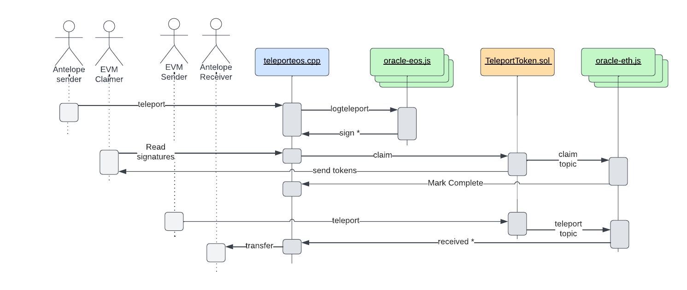

# **Alien Teleport**

## Overview

The Alien Teleport provides a mechanism for transferring fungible tokens between EVM blockchains and Antelope blockchains. On each side of the interblockchain transfer custom contracts are required to be deployed with custom actions to handle the sending and receiving of tokens in both directions.

On the Antelope side the token should be a `eosio.token` compatible, fungible token managed in it's own separate contract. The Antelope side of the teleport is centered around the smart contact `teleporteos.cpp` in this repo. At a high level this contract receives and locks tokens that are intended to be "transferred" to an EVM based blockchain. These tokens will remain locked in this contract until the tokens are sent back to the Antelope side, at which time an amount of locked up tokens will be unlocked and transferred to the new intended recipient. This contract does not mint or burn any tokens.
A chain_id parameter in each teleport allow this contract to support transfers to multiple EVM blockchains within the one contract instance on Antelope.

The counterpart smart contract to be deployed on the EVM chain is `TeleportToken.sol` also in this repo. This is an ERC-20 compatible smart contract with added features to support the teleport sending and receiving. The EOSIO/Antelope contracts handles most of the logic by design to take advantage of the lower costs and higher throughput on Antelope blockchains. This logic includes storing the details for outgoing teleports to EVM chains as well as the details for incoming teleports from EVM chains. Each EVM instance can only handle a bridge to one Antelope chain. Therefore moving tokens from one EVM chain to another would require bridging to the common Antelope chain before bridging to the other EVM chain.

Each teleport action, in either direction requires a precondifgured number of registered oracles to verify the details of the teleport before the transaction can complete. The verification involves checking the amounts, intended recipients and the signature data to prove these details cryptographically. Rather the actions being mirrored in both directions they are slightly different to allow for the nature of EVM transactions being more expensive and requiring gas fees. Specifically, teleport, sign, receive and completing a teleport are all recorded on WAX with the transfer of received tokens being sent directly on WAX. On EVM chains, teleports are sent and paid for by the sender and receipt of tokens must claimed by the receiver, so in both cases the end user is paying for the gas fees.

## Process

* Transferring from Antelope -> EVM requires depositing the tokens to the EOSIO contract with a standard transfer (no memo required), then teleporting the tokens using the `teleport` action. These two actions will typically be completed within one transaction to enforce atomic execution of both actions and prevent half processed teleports.
  * The EVM recipient will then need to `claim` the teleport on the EVM side by submitting the oracle signatures that have observed the teleport with the `sign` action that are verified within the claim function on EVM

* Transferring from EVM -> Antelope simply requires calling the `teleport` function on the Ethereum contract. When sufficient oracles have observed the teleport with the `received` action the transfer will send to the recipient. No claim action is required in this direction.
  
## Oracles

The oracles scripts, included in this repo, manage the verification in both directions by watching the live chain activity for their respective chains and reponding as required. Correct configuration of these scripts means this process can run autonomously with no regular maintenance required. No gas fees is required by the oracles since the scripts don't sign any EVM transactions. All the RAM costs are covered by the Antelope smart contract. So only a moderated amount of Antelope resources are required to cover the CPU/NET costs of signing the oracles actions onto the Antelope blockchain.
Only monitoring is recomended around the oracles script processes to ensure there are no teleports actions that left without oracle signatures for more than a few minutes.
* `oracle-eos.js` handles Antelope user initiated teleport actions (including multiple EVM chains simulataneously selected via a chain_id). Only one Antelope chain is support at this stage.
* `oracle-eth.js` handles EVM user initiated teleport actions. Each EVM chain requires a separate instance of this script to be running and can only transfer to one Antelope chain.

## Setup

To run as an oracle, each oracle will need to be able to run 3 scripts included in the repo (`oracle-eos.js` and `oracle-eth.js` configured for BSC chain and another `oracle-eth.js` process configured for Ethereum). This URL details should added to a config file (based on `./oracle/config-examle.js` of this repo). Each will need access to a running SHiP node for the live transactions on WAX and the ability query an endpoint for table data on WAX. They will also need the equivalent on the Eth/BSC side to track live transactions and be able to query for block data - via a service provider.

Oracle accounts must be registered using the `regoracle` (Antelope) and `regOracle` (EVM) functions. These actions require the auth of federation@active to prevent anyone from registering in an uncontrolled way.

Successfully registered oracles can then call the received function on each contract when they see a transaction on the opposing chain. The oracles scripts and smart contracts on each chain verify the data is correct automatically. Other than configuring oracle signing keys and API endpoint details there is no code or further configuration required.

### Configuration

1. Copy config-example.js to config.js
2. Change the configuration settings to match your tokens
3. Start the oracle using the following command `CONFIG=./[path/to/config] oracle-eos|eth.js`

## Sequence:

---
## Inner technical details
`oracle-eos.js` - script that processes teleport actions from EOSIO chain to EVM chains.
    This script registers to listen for actions on the WAX blockchain. Specifically it is handling the `logteleport` action in the `other.worlds` contract on WAX which has the `teleporteos.cpp` contract installed.
    When this action is encountered the data is queued for processing.
    Processing involves the oracle taking the data from the `logteleport` action, signing it with their eth private key and then sending the signature to the `teleporteos.cpp` contract with the `sign` action where it is stored with the teleport record, ready for claiming on the EVM side.

`oracle-eth.js` - script that reads the latest blocks on the associated EVM chain (or from a designated blocknumber for replaying) and runs both `process_claimed` and `process_teleported` internal functions for each block.

* `process_claimed` - queries the EVM chain for emitted events of type `claimed_topic` (`0xf20fc6923b8057dd0c3b606483fcaa038229bb36ebc35a0040e3eaa39cf97b17`) which will be an event emitted after a user has successfully execution the claim action on the EVM chain. The event data is then decoded to extract the teleport id, the receiving EVM address and the token amount to receive. This extracted data is then pushed to the WAX chain in the `claimed` action by the running oracle which further validates the details in the Antelope smart contract and marks the teleport as claimed.
* `process_teleported` - queries the EVM chain for emitted events of type `teleport_topic` (`0x622824274e0937ee319b036740cd0887131781bc2032b47eac3e88a1be17f5d5`). The event data is decoded to extract the WAX account recipient, the chain_id for the teleport, the quantity of tokens to teleport and the tx_id. The data is then signed and pushed by the oracle to the Antelope smart contract through the `received` action.
* The `received` action in the Antelope contract creates, or updates an existing, receipt record for the teleport. Then if there are enough oracles that have also called `received` for the same teleport reference, the tokens are transferred to the intended recipient for the teleport and the `receipt` is marked as completed on the WAX chain.
* The `claim` function on the EVM contract side is called by the token claimer on the EVM chain (Eth/BSC) and with the data for the teleport to be claimed and the signatures of the oracles who have signed the teleport, as extracted from the `teleports` table on Wax for the specific teleport being claimed. The data is deserialised to extract all the teleport details and the signatures are verified against the data to ensure they have all signed the same data. If there are enough unique valid signatures for the teleport to meet the orcale threshold, with all fields matching as required, the EVM contract credits the new balance to the recipient account on the EVM chain and then emits the `claimed_topic` event to be read fo the oracle scripts to process the claim.